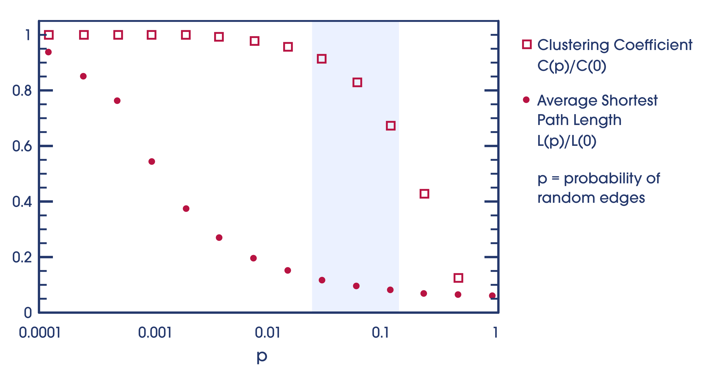
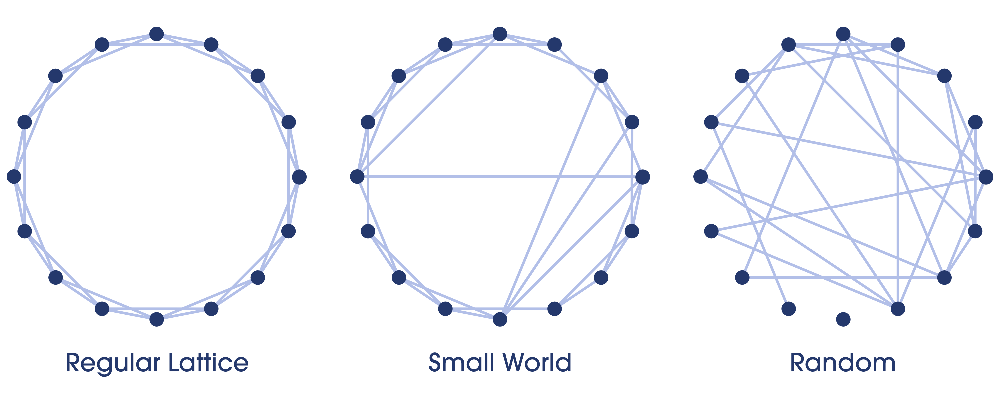
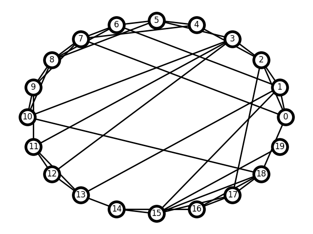
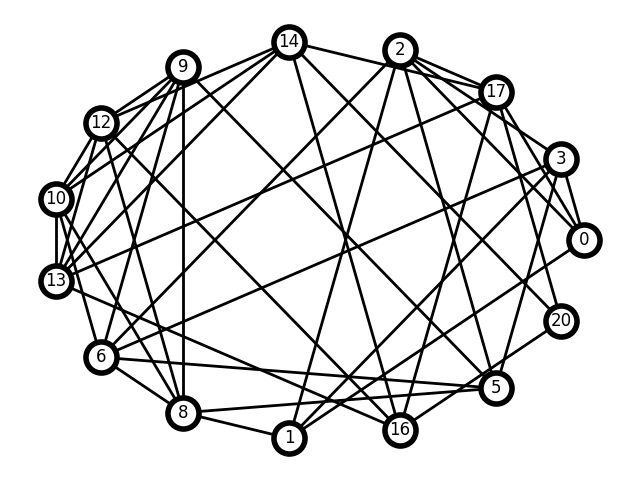

# Hierarchical Navigable Small World: a scalable nearest neighbor search

# Introduction

"Hierarchical Navigable Small World" (HNSW): an intriguing mouthful, designating a dense bouquet of concepts developed in the last 70 years in sociology, graph theory, and algorithmic science. In this brief tutorial, we'll examine these concepts carefully and attempt to solidify our understanding with proof-of-concept code and as many visualizations as possible.

---

The first thing to understand about HNSW is that it's primarily an optimized data structure, not an algorithm. Actually the algorithm used with these structures is remarkably simple: a greedy search which simply looks among all current candidates for the closest target value.

What's brilliant about HNSW therefore is not its search routine, but its optimized structure for a *decentralized similarity search* using a simple greedy traversal. This makes it ideal as the backbone for realtime search applications.

---

An [important paper in 2016][malkov_2016] introduced the term "Hierarchical Navigable Small World", designating a novel kind of approximate nearest neighbor search. But to examine HNSW, we need to unpack the term's historical layers as though it were Lisp or Polish notation: `(Hierarchical (Navigable (Small World)))`.

1. *Hierarchical*: referring to stacked subgraphs of exponentially decaying density, a structure which addresses the problem of high dimensionality.
1. *Navigable*: referring to the search complexity of the subgraphs, which achieve (poly)logarithmic scaling using a [decentralized greedy search][navigability] algorithm.
1. *Small World* : referring to a unique graph with low average shortest path length and a high clustering coefficient.

Thus we begin at the end: what's a "Small World"?

# (Small World)

What is a "Small World" (SW) graph? It's graph structure which achieves a unique balance between regularity and randomness, poised at the sweet spot in which the advantages of both can be achieved. The name comes from exactly what you might expect: it's what strangers say when they have an acquaintance in common, or when you see an old friend by chance in a foreign city. With [a remarkably simple experiment][sw_experiment], the influential sociologist Stanley Milgram was able to show that this feeling is demonstrably true: he asked people to forward letters to geographically distant strangers using only first-name acquaintances as links, and it turns out that the "six degrees of separation" in saturated social networks holds true.

Ideally, what we want from a graphical structure in the context of a search routine, is the ability to find our goal efficiently no matter where we begin. This requires that we address these contingencies:

1. We're far from our goal. This requires that we travel far without excessive cost: in other words, that long-distance links across the graph can be found. Randomly connected graphs tend to have long-distance links.

2. We're close to our goal. This requires that we travel short distances without too many steps: thus that short-distance links can be found. Regular lattice graphs tend to have many short-distance links.

---

For example, imagine you'd like to travel from Seal Point Park in San Mateo, California to Prospect Park in Brooklyn, New York. You could walk, ride a bike, drive, or take a personal helicopter in short trips. But even if you were driving, if the travel network were only locally connected it would require that you use only local roads between towns, and the trip would be highly inefficient.

In practice what we do is to navigate small highly clustered networks locally, find a hub with long distance links, and revert to local navigation again: we use our feet, then a car, then a train, then a plane, then a car, then our feet again. This is what small world graphs seek to emulate: many features in nature and civilization can be modeled as a small world graph, with both a high *clustering coefficient* and a low *average shortest path*.

## Balancing L and C: the far is near and the near is nearer

What do these terms mean?

* *L, average shortest path length*: A desirable *L* simply means that the distance between any two given nodes is generally reasonable. To achieve this property, a graph must have a good distribution of long-distance edges: however, a balance is desirable, since too many edges will burden the greedy search inner loop, and too few will inflate our average path length.

* *C, clustering coefficient*: The clustering coefficient is a measure of the degree of connectedness between nearby nodes, calculated as the ratio of actual edges to possible edges among the neighbors of any given node.

Random graphs tend to have a low *L*, because they make connections between distant nodes such that getting stuck iterating through a local network far from your goal is unlikely. On the other hand, regular lattice graphs have high *C*, because local nodes are connected by definition. The interesting thing about SW graphs is that they achieve a balance between these desirable features, by sitting somewhere between order and chaos:



Moreover, a SW graph can be constructed by either adding random connections to an ordered graph, or adding order to a random graph. Consulting the [original 1998 paper by Watts and Strogatz][ws] on small world graphs, we read:

> These small-world networks result from the immediate drop in L(p) caused by the introduction of a few long-range edges. Such ‘short cuts’ connect vertices that would otherwise be much farther apart than Lrandom. For small p, each short cut has a highly nonlinear effect on L, contracting the distance not just between the pair of vertices that it connects, but between their immediate neighbourhoods.

In the progression below, notice that in the regular lattice, getting from one side of the ring to the other would be inefficient. While in the random graph, traversing from one locale to another close by might be inefficient or even impossible:



---

To demonstrate this idea in practice, take a look at our sample implementation:

```python
def MakeNSW(n=20, d=4, p=0.2):
    G = MakeRingLattice(n, d)
    Rewire(G, p)
    return G

def MakeRingLattice(n, d):
    offsets = range(1, (d//2) + 1)
    return nx.circulant_graph(n, offsets)

def Rewire(G, p):
    all_nodes = set(G)
    for u, v in G.edges():
        if np.random.random() < p:
            u_connections = set([u]) | set(G[u])
            choices = all_nodes - u_connections
            new_v = np.random.choice(list(choices))
            G.remove_edge(u, v)
            G.add_edge(u, new_v)
```

All we've done is create a regular ring lattice with a constant degree, and then mess it up a little by adding a small number of random edges. It turns out this is enough to approximate the "small world" graph concept, which like many complex artifacts of nonlinearity in the real world, serves as an adequate model for a startling variety of phenomena otherwise intractable to quantifiable metrics: including neural networks, social networks, metabolic activity, and more.

A generated NSW:



Try out the sample code if you wish: just play with the `-p` parameter to generate a variety of graphs. For example, to create a highly randomized graph:

``` sh
python nsw.py -p 1
```

# (Navigable (Small World))

Our next term from HNSW to unpack is "navigable". What does "navigable" mean in the context of graph theory? Quoting from [a followup paper][malkov_2016_06] by Malkov and Ponomarenko:

> navigability, an ability to find a logarithmically short path between two arbitrary nodes using only local information, without global knowledge of the network.

In other words, the readiness of a graph for an efficient greedy search. Achieving logarithmic search complexity is generally considered the grand prize of algorithmic efficiency: thus the promise of creating a structure which affords both similarity search and logarithmic complexity at scale is why HNSW is such a big deal.

## What do we mean by greedy search?

Let's back up a moment and define another relevant term: *greedy search*. This is "greedy" in the sense that only the *local* optimum is considered when finding the *global* optimum. There is no attempt to predict future outcomes nor learn from the past: the algorithm simply makes the best choice at every step. This kind of algorithm generally only works with orderly data structures and relatively uniform data, such as binary trees and sorted arrays - technically any problem with an optimal substructure. The advantage of this algorithm is its simplicity and robustness. It can be [this simple][greedy.py]:

``` python
def GreedySearch(G, q, venter):
    vcurr = venter
    σmin= Distance(q, vcurr)
    vnext = None
    for vfriend in nx.neighbors(G, vcurr):
        if σfriend := Distance(q, vfriend) < σmin:
            σmin = σfriend
            vnext = vfriend
    if vnext == None:
        return vcurr
    else:
        return GreedySearch(G, q, vnext)
```

## Polylogarithmic scaling of NSW

Yet despite all this, the NSW graph isn't quite performant enough for modern computing. Quoting from [the original HNSW][malkov_2016] paper by Malkov and Yashunin:

> The average number of hops scales logarithmically, while the average degree of the nodes on the greedy path also scales logarithmically due to the facts that: 1) the greedy search tends to go through the same hubs as the network grows; 2) the average number of hub connections grows logarithmically with an increase of the network size. Thus we get an overall polylogarithmic dependence of the resulting complexity.

Therefore greedy search ends up yielding a polylogarithmic complexity, which is not terrible, but not great for high dimensionality. The overall cost is roughly:

    O(logn*logk)

or

    (average number of nodes evaluated)*(average degree of nodes)

*Both* of which scale logarithmically as the graph grows, since the average *k* degree is greatly influenced by the number of "hub" nodes. So, we proceed further in the historical evolution of HNSW to its latest innovation.

# (Hierarchical (Navigable (Small World)))

We are finally prepared to ask: what is "hierarchical" in this context? It means that instead of searching one dense graph, we search rather a set of layers representing that same graph at distinct scales. An HNSW structure is a set of replicated NSW graphs, which grow sparser and wider at every iteration. If you collapsed the layers, you'd have a single NSW graph again.

Take a look at [the sample implementation][hnsw.py]: it was written as an attempt to mirror the original research formulation as closely as possible with readable Python. Most of the uninteresting functions are factored out of the two main functions, `Insert` and `SearchLayer`. It may help at this point to play with the code to get a sense for what's happening. Try running the script with various values for the commandline flags:

```sh
python hnsw_graphs.py --maxk=10 --ml=0.5
```

To see them all:

```sh
python hnsw.py --help

Options:
  -l, --layers INTEGER  number of hierarchical layers  [default: 10]
  -k, --maxk INTEGER    max degree per node  [default: 5]
  -n, --nodes INTEGER   number of nodes to insert  [default: 20]
  --ef INTEGER          max size of the candidate set during search  [default: 5]
  --ml FLOAT            normalization factor for probability of inserting
                        nodes at subsequent levels  [default: 3.0]
  -d, --display         whether to display the graphs using plt.Show()
  --save / --nosave     whether to save the graphs as .png files to disk
```

Some layers from a single run are shown below. (Note that `nx.draw_circular` doesn't preserve node locale, so the nodes may change location while the edges are preserved.) Notice how the graphs become sparser:



The idea is to solve the polylogarithmic scaling of NSW graphs by eliminating early iteration through highly connected hub nodes, keeping only the relevant long-range edges in the early stages of the search. According to our earlier analogy, that'd be like taking a plane, then a car, and finally walking.

The genius of this idea is especially evident when one considers the simplicity of the mechanism required to create these layers. The most important line in our implementation is:

``` python
layer_i = floor(-1 * log(random()) * mL)
```

Where `mL` is just a normalization parameter to distribute the layers appropriately among some reasonable range. The idea is that the distribution of nodes among our layers decays exponentially, mirroring the logarithmic search complexity we want. The resulting structure is similar to the "[skip list][skiplist]", which is a sorted linked list with layers created probalistically.

There is one other important factor in the creation of these layers: at the stage when nearest neighbors are selected for insertion, a heuristic is applied which prefers long distance connections, thus creating graphs which are not only sparse but *wide*. Quoting Malkov and Yashunin again:

> The idea of Hierarchical NSW algorithm is to separate the links according to their length scale into different layers and then search in a multilayer graph. In this case we can evaluate only a needed fixed portion of the connections for each element independently of the networks size, thus allowing a logarithmic scalability.

---

Note that our implementation currently uses only the simple `SelectNeighbors` routine for maximum clarity. Probably the most important section from the insertion stage is this:

```python
for lc in range(min(topL, layer_i), -1, -1):
    layer = GetLayer(HNSW, lc)
    W = SearchLayer(layer, q, eP, efConstruction)
    neighbors = SelectNeighbors(q, W, maxk)
    AddEdges(layer, q, neighbors)
```

Which means, iterate down the layers, searching each for nearest nodes to our query beginning from our entry point, and make connections to them. There's lots of parameters to tweak along the way, but the general idea is still remarkably simple.

---

Hopefully we've gained a new appreciation of the importance of HNSW and its relevance to scalable similarity search.

To learn more, check out Qdrant's implementation of HNSW and [its performance metrics][qdrant_benchmark].

[sw_experiment]: https://en.wikipedia.org/wiki/Small-world_experiment

[malkov_2016]: https://arxiv.org/abs/1603.09320

[malkov_2016_06]: https://doi.org/10.1371/journal.pone.0158162

[navigability]: https://doi.org/10.48550/arXiv.1501.04931

[ws]: https://www.nature.com/articles/30918

[skiplist]: https://brilliant.org/wiki/skip-lists/

[hnsw.py]: https://github.com/thwh/hnsw/blob/master/hnsw.py

[greedy.py]: https://github.com/thwh/hnsw/blob/master/greedy.py

[qdrant_benchmark]: https://qdrant.tech/benchmarks/
